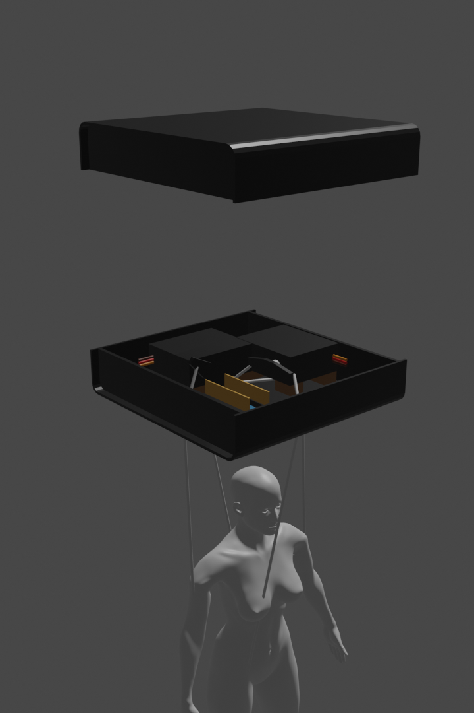

# anti-art
## Puppet controlled by artificial intelligence
That is - an arduino controlling two servos randomly which move a marionette via strings.  
  
### Why?  
To mock artists who lie about their works incorporating artificial intelligence.  
Project for http://www.aitheism.net/  
  
### Images
  
  

### Stickers to be put on black box
  
  
  
  
  